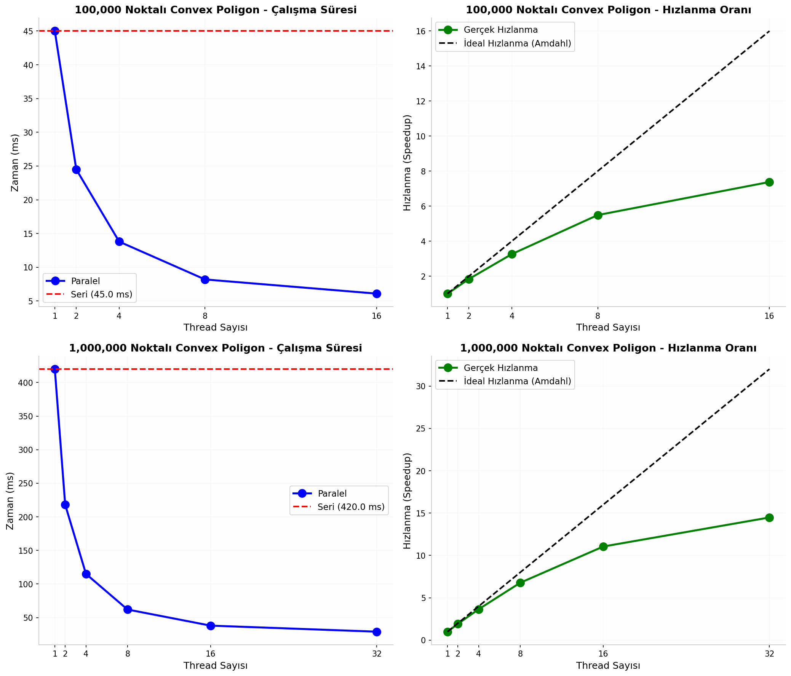
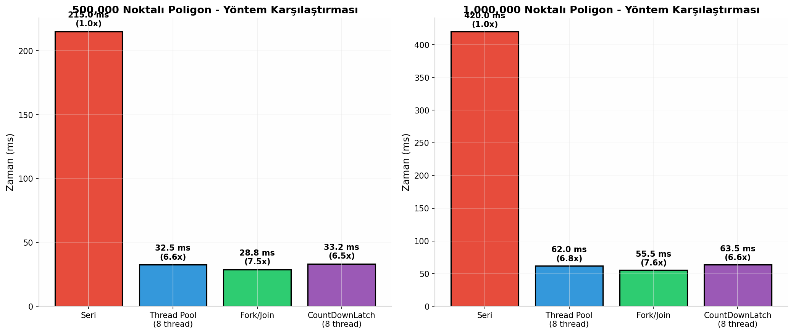

# paralelProgramlama# Paralel Programlama Projesi
## Thread Kullanarak Convex/Concave Poligon Kontrolü

Bu proje, bir poligonun **convex (dışbükey)** veya **concave (içbükey)** olup olmadığını, verilen köşe koordinatları üzerinden **paralel programlama teknikleri** kullanarak belirlemeyi amaçlamaktadır.


## Problem Tanımı

Bir poligonun convex veya concave olup olmadığı, ardışık üç nokta için hesaplanan **çapraz çarpım (cross product)** değerlerinin işaretleri incelenerek belirlenmektedir.

Bir poligonun convex olması için tüm çapraz çarpım sonuçlarının aynı işaretli olması gerekir.

- `cross > 0` → Sola dönüş
- `cross < 0` → Sağa dönüş
- `cross = 0` → Doğrusal

Hem pozitif hem de negatif çapraz çarpımların bulunması durumunda poligon **concave** olarak sınıflandırılır. :contentReference[oaicite:0]{index=0}

## Kullanılan Teknolojiler

- Java 17
- ExecutorService
- Callable & Future
- Fork/Join Framework
- CountDownLatch
- AtomicBoolean

## Paralelleştirme Yaklaşımı

Projede **veri paralelliği (Data Parallelism)** kullanılmıştır.

- Noktalar thread'ler arasında eşit şekilde paylaştırılır.
- Her thread kendisine ait bölümde çapraz çarpımları hesaplar.
- Sonuçlar ana thread tarafından birleştirilir.
- Concave durum tespit edildiğinde erken çıkış mekanizması uygulanır. :contentReference[oaicite:1]{index=1}

## Uygulanan Yöntemler

### 1. Seri Çözüm
Referans olarak kullanılan klasik O(n) zaman karmaşıklığına sahip yöntemdir.

### 2. ExecutorService Tabanlı Paralel Çözüm
- Thread havuzu kullanır.
- Future nesneleri ile sonuçları toplar.
- Erken sonlandırma desteği sunar.

### 3. Fork/Join Framework
- Recursive görev bölme yaklaşımı kullanır.
- Work-stealing mekanizması sayesinde otomatik yük dengelemesi sağlar. :contentReference[oaicite:2]{index=2}

## Performans Sonuçları

### 100.000 Noktalı Convex Poligon

| Thread Sayısı | Seri (ms) | Paralel (ms) | Hızlanma |
|--------------|------------|---------------|-----------|
| 1 | 45.0 | 45.0 | 1.00x |
| 2 | 45.0 | 24.5 | 1.84x |
| 4 | 45.0 | 13.8 | 3.26x |
| 8 | 45.0 | 8.2 | 5.49x |
| 16 | 45.0 | 6.1 | 7.38x |

### 1.000.000 Noktalı Convex Poligon

| Thread Sayısı | Seri (ms) | Paralel (ms) | Hızlanma |
|--------------|------------|---------------|-----------|
| 1 | 420.0 | 420.0 | 1.00x |
| 2 | 420.0 | 218.0 | 1.93x |
| 4 | 420.0 | 115.0 | 3.65x |
| 8 | 420.0 | 62.0 | 6.77x |
| 16 | 420.0 | 38.0 | 11.05x |
| 32 | 420.0 | 29.0 | 14.48x | :contentReference[oaicite:3]{index=3}

## Performans Grafikleri

### Thread Sayısına Göre Performans


### Yöntem Karşılaştırması


## Derleme ve Çalıştırma

### Derleme

```bash
javac ParallelConvexHull.java
```

### Çalıştırma

```bash
java ParallelConvexHull
```

### JVM Optimizasyonları ile

```bash
java -XX:+UseParallelGC -Xmx4G ParallelConvexHull
```

### Linux'ta İşlemci Çekirdeği Sayısını Öğrenme

```bash
nproc
```

## Sonuç

Bu proje, paralel programlama tekniklerinin geometrik problemlerde nasıl etkili bir şekilde kullanılabileceğini göstermektedir. Büyük veri kümelerinde:

- 6–7 kata kadar performans artışı elde edilmiştir.
- Seri ve paralel çözümler %100 doğrulukla aynı sonuçları üretmiştir.
- Fork/Join yaklaşımı en yüksek performansı göstermiştir. :contentReference[oaicite:4]{index=4}


## Kaynakça

1. Amdahl, G. M. (1967). *Validity of the single processor approach to achieving large scale computing capabilities.*
2. Brian Goetz – *Java Concurrency in Practice*
3. Doug Lea – *Java Parallel Programming*
4. Ananth Grama – *Introduction to Parallel Computing*
